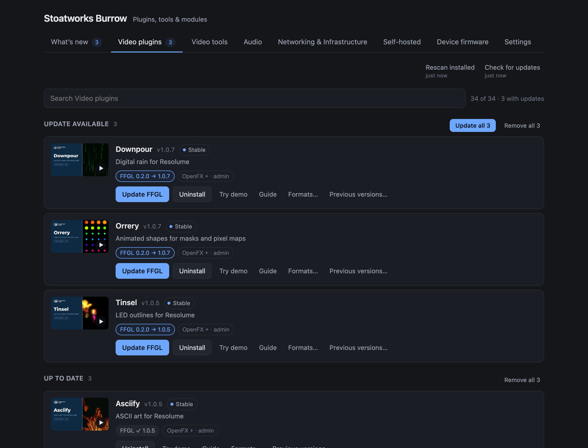
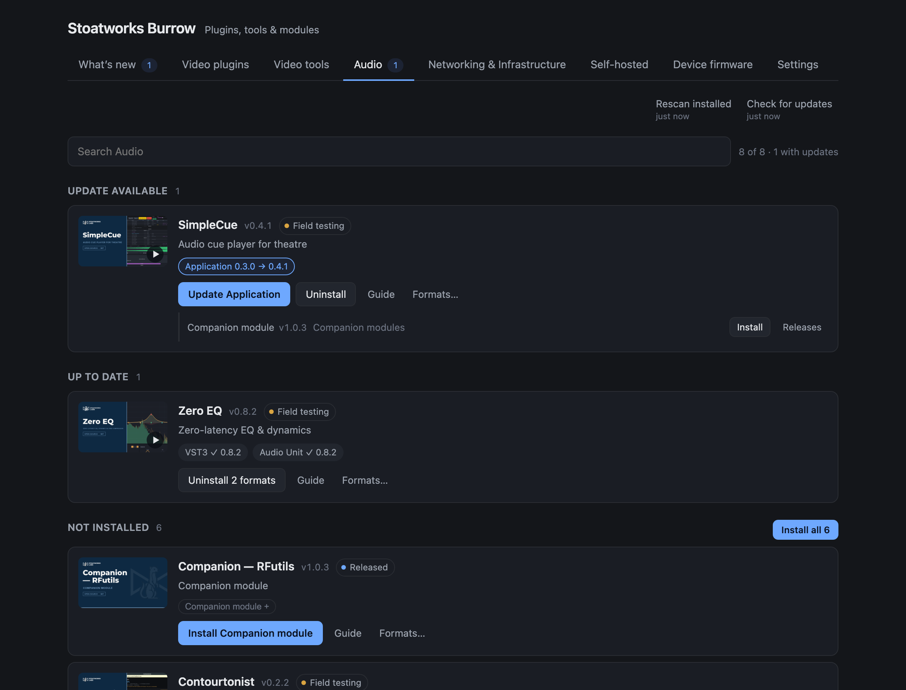
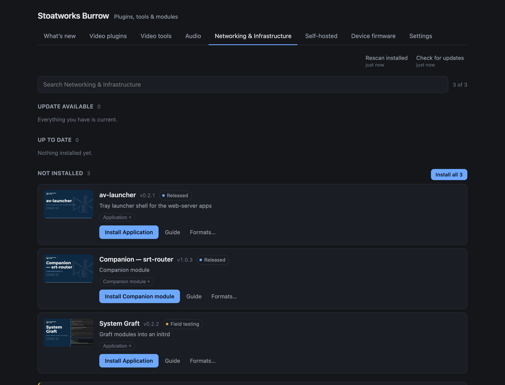
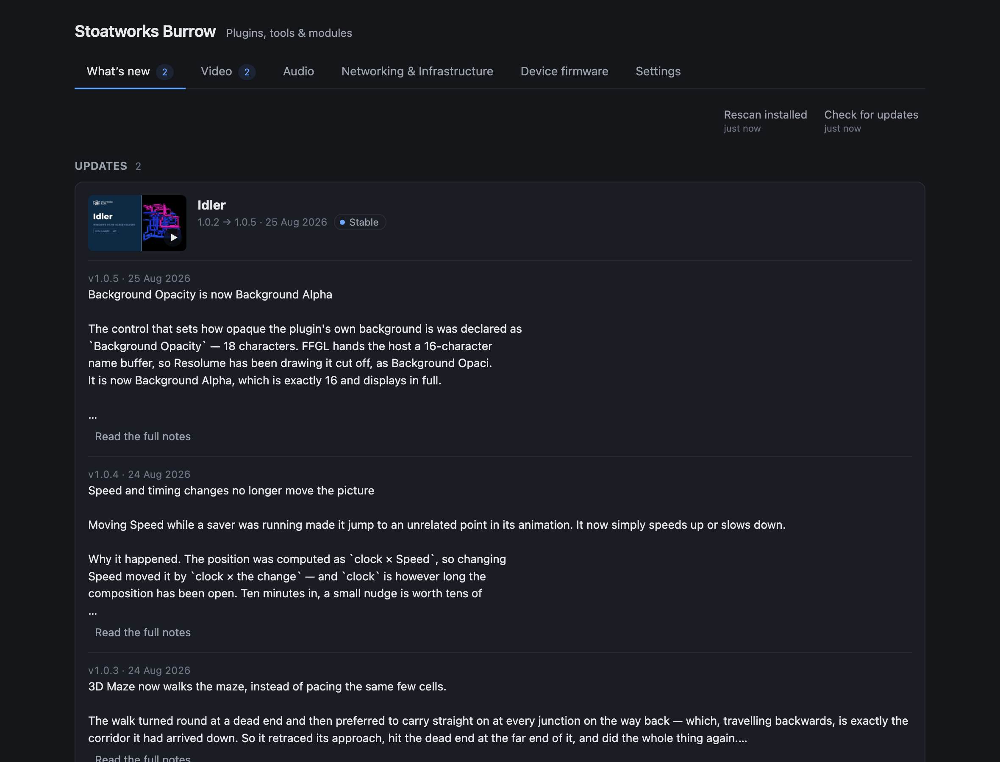
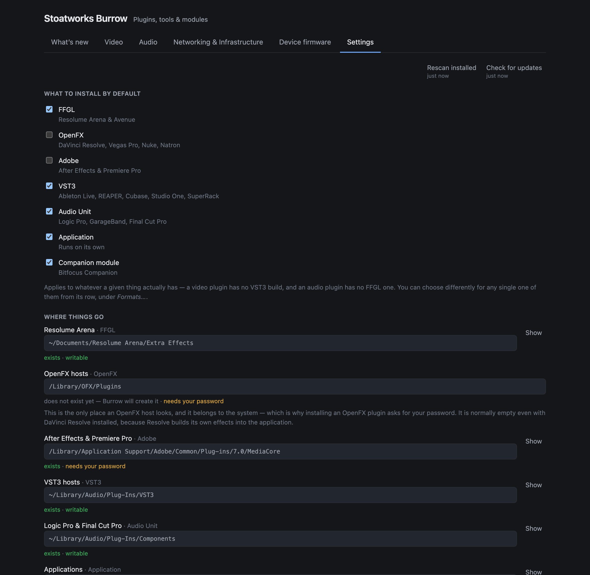
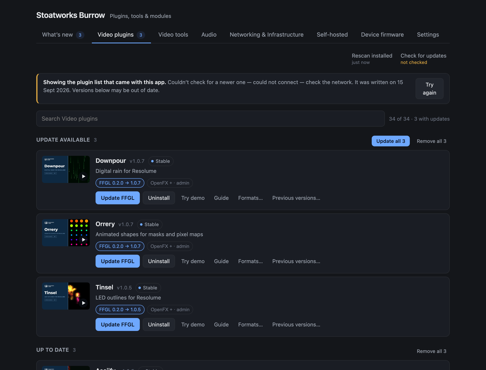

# Stoatworks Burrow

> **AI-assisted project.** This codebase was created with [Claude](https://claude.com/claude-code)
> (Anthropic), directed and reviewed by a human author. The catalogue, the install
> and uninstall paths, the archive guards and the privileged helper's refusals have
> all been exercised against real release archives on macOS. **Nothing has yet been
> installed into a live host through the finished app** — the plugin folder work is
> verified against temporary directories and the real `Extra Effects` folder is only
> ever *read*. The Windows privileged helper is not written at all. Treat it as
> unfinished.

An optional desktop app that installs, updates and removes the
[Stoatworks](https://stoatworks-labs.com) plugins, tools and Companion modules.

It began with the twenty-five video plugins, which are the hard case: most ship in
two or three formats — FFGL for Resolume, OpenFX for Resolve, Vegas, Nuke and
Natron, and an After Effects build — and installing one by hand means finding the
project page, working out which of six archives you want, unzipping it, and
dragging a bundle into a folder whose location differs per format and per platform.

It now covers the rest of the fleet on the same terms, under four tabs:

| | |
|---|---|
| **Video** | The Resolume, Resolve and After Effects plugins, and the video tools around them. |
| **Audio** | VST3 and Audio Unit plugins, and the audio tools that run on their own. |
| **Networking & Infrastructure** | The tools that move signals around a network and keep a rack running. |
| **Device firmware** | Coming soon. |

Applications are placed from their disk image, and every tool that has a
[Bitfocus Companion](https://bitfocus.io/companion) module offers it on the same
row — Companion's own developer modules folder is a destination like any other.

Burrow is one searchable list instead of all that.

**Video:** [What it does, in 43 seconds](https://www.youtube.com/watch?v=NRaDQlkksXA)

<table>
  <tr>
    <td align="center"><br><sub>Video</sub></td>
    <td align="center"><br><sub>Audio &mdash; with a Companion module on its tool&rsquo;s row</sub></td>
  </tr>
  <tr>
    <td align="center"><br><sub>Networking &amp; Infrastructure</sub></td>
    <td align="center"><br><sub>What&rsquo;s new</sub></td>
  </tr>
  <tr>
    <td align="center"><br><sub>Settings</sub></td>
    <td align="center"><br><sub>Offline, saying so</sub></td>
  </tr>
</table>

*The real interface, with real plugin names, versions and release notes from the
catalogue that ships inside the app. What is shown as installed is staged, via
[`scripts/screenshot.sh`](scripts/screenshot.sh) — several of these states are
awkward to produce on demand, and one of them is a cancelled password prompt.*

- **What's new** — release notes for updates you could take, and plugins you
  haven't seen.
- **Video · Audio · Networking & Infrastructure** — everything in that part of the
  fleet, under *Up to date*, *Update available* and *Not installed*, with per-format
  state on each row, and how far along each project is — *Field proven*, *Field
  testing*, *Released*, *In development* — in the same words the website uses.
- **Settings** — what to install by default, overridable per item, and where each
  one goes.

Each plugin's video is the picture at the left of its row — click it and it plays
in the window, streamed from the project's own GitHub release rather than embedded
from YouTube. No cookies, no ads, no third party. The stills ship with the app, so
the list works offline and nothing is fetched until you press play.

**Previous versions…** on any row rolls a plugin back to an earlier release,
which matters when something misbehaves mid-show-week.

Two refresh controls, because they are different jobs: **Rescan installed**
re-reads your plugin folders with no network at all, and **Check for updates**
fetches the plugin list. Both report what they actually changed.

Every plugin's browser demo is **built in**: press *Try demo* and it runs locally,
offline, from an address only this app knows.

## No account, and nothing phoned home

There is no sign-in, because there is nothing to sign in to.

Burrow fetches one file — the plugin list at `stoatworks-labs.com/catalog.json` —
and downloads plugin archives and project videos from GitHub. That is the whole of
its network use. It sends no identifier, no list of what you have installed,
and no usage data. The demos are served with no permission to make network
requests at all.

Project videos stream from GitHub too, and only when you press play — the stills
are bundled, so the list itself fetches nothing. The feedback button is the only
other thing that sends anything, and only what you type into it.

The *Send feedback* button at the bottom of the window is the one exception, and
only when you press it.

## Installing things that need a password

Two formats do, out of seven. FFGL plugins go into your own Documents folder, VST3s
and Audio Units into your own `~/Library/Audio/Plug-Ins`, Companion modules into a
folder you nominate, and applications into `/Applications` when you can write there
and `~/Applications` when you cannot — none of which needs anything special.

OpenFX and After Effects plugins go into system directories — `/Library/OFX/Plugins`
and Adobe's shared `MediaCore` folder — and there is no user-writable alternative
either host will look in. So Burrow asks for an administrator password, **once per
batch**, and hands a small separate helper program a list of file moves to make.

That helper cannot do anything else. It has no network client and no archive
decoder compiled into it, it will only write inside a fixed list of plugin
directories, and it will only delete a file it has itself just renamed moments
earlier in the same operation. Everything else — downloading, unpacking, checking —
happens beforehand without any elevated rights.

Unprivileged work always runs first, so if you change your mind at the password
prompt, the plugins that did not need it are already installed.

## Status

**Not released.** What has been verified, on macOS:

- The catalogue builds from the live fleet data and serves correctly — 65 entries
  across the three categories, including the two plugins that publish no `latest`
  alias and would otherwise be missing.
- A real disk image — simpleVIS 0.4.0 — mounts, yields its `.app`, validates,
  installs and uninstalls against a temporary directory, with the version read back
  out of the bundle's `Info.plist`.
- Real release archives extract, validate, de-quarantine, install and uninstall
  against temporary directories — including downpour's two bundles, and cartridge's
  archive of documentation and a command-line helper alongside the plugin.
- Scanning reads this machine correctly: twelve installed plugins with versions from
  their `Info.plist`, and every foreign bundle in the same shared folder correctly
  invisible.
- The privileged helper refuses every hostile plan it was given — traversal, a path
  outside the whitelist, a forged deletion nonce, a wrong owner, a loose file mode.

What has **not**:

- No plugin has been installed into a running Resolume, Resolve or After Effects
  through the app, and no audio plugin into a running DAW.
- No application has been installed into a real `/Applications`, and no Companion
  module into a real Companion.
- The audio and application entries carry no release notes yet: the script that
  collects them is still plugins-only, so "What's new" is quiet about them.
- The macOS authorisation prompt has never been driven end to end.
- The quarantine clearing cannot be proven from a local build — it needs a
  downloaded, Gatekeeper-quarantined copy of the app itself.
- Windows has no privileged helper, so OpenFX and Adobe installs are refused there
  with an explanation. FFGL is unaffected.

<!-- downloads:start -->

## Download

**[v0.1.3](https://github.com/stoatworks-labs/burrow/releases/tag/v0.1.3)** — prebuilt for macOS and Windows. Pick your platform:

<details>
<summary><b>macOS</b> — Apple Silicon, Intel</summary>

| Build | Download | Size |
| --- | --- | --- |
| Apple Silicon · .dmg disk image | [`burrow-0.1.3-macos-aarch64.dmg`](https://github.com/stoatworks-labs/burrow/releases/download/v0.1.3/burrow-0.1.3-macos-aarch64.dmg) | 8.5 MB |
| Intel · .dmg disk image | [`burrow-0.1.3-macos-x86_64.dmg`](https://github.com/stoatworks-labs/burrow/releases/download/v0.1.3/burrow-0.1.3-macos-x86_64.dmg) | 8.8 MB |
| Apple Silicon · .pkg installer | [`burrow-0.1.3-macos-aarch64.pkg`](https://github.com/stoatworks-labs/burrow/releases/download/v0.1.3/burrow-0.1.3-macos-aarch64.pkg) | 8.5 MB |
| Intel · .pkg installer | [`burrow-0.1.3-macos-x86_64.pkg`](https://github.com/stoatworks-labs/burrow/releases/download/v0.1.3/burrow-0.1.3-macos-x86_64.pkg) | 8.8 MB |

</details>

<details>
<summary><b>Windows</b> — x64</summary>

| Build | Download | Size |
| --- | --- | --- |
| x64 · .exe installer | [`Stoatworks.Burrow_0.1.3_x64-setup.exe`](https://github.com/stoatworks-labs/burrow/releases/download/v0.1.3/Stoatworks.Burrow_0.1.3_x64-setup.exe) | 6.9 MB |

</details>

All builds, checksums and release notes: [github.com/stoatworks-labs/burrow/releases](https://github.com/stoatworks-labs/burrow/releases).

macOS builds are signed and notarised and open normally. The Windows builds are unsigned, so SmartScreen warns once.

<!-- downloads:end -->

## Building it

```bash
npm install
./scripts/sync-assets.sh    # catalogue, demos, thumbnails, the helper binary
npm run tauri dev
```

`sync-assets.sh` gathers what ships inside the app from the plugin repos and the
website checkout. It needs both alongside this one, and the website built at least
once (`npm run build` there) so `dist/catalog.json` exists.

Tests:

```bash
cargo test --workspace
```

The interesting ones are in `crates/burrow-plan` (what the privileged helper will
refuse) and `crates/burrow-core` (reconciling the ledger against a real plugin
folder). Both are free of Tauri so they run on every platform in CI, including the
Windows paths that cannot be exercised by hand on a Mac.

To point the reconciliation logic at your own machine without a GUI:

```bash
cargo run -p burrow-core --example scan -- path/to/catalog.json
```

It reads, and writes nothing.

## Licence

MIT — see [LICENSE](LICENSE).

<!-- attributions:start -->
This project is built on other people's work — see [ATTRIBUTIONS.md](ATTRIBUTIONS.md).
<!-- attributions:end -->
